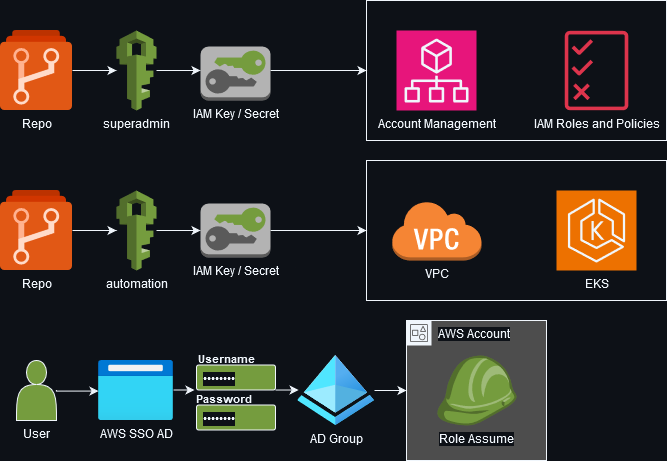
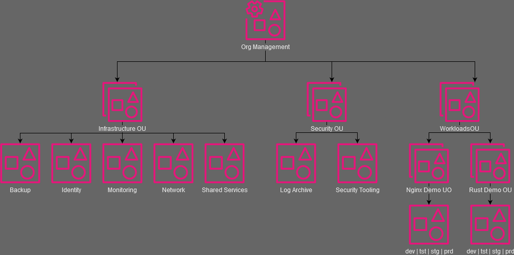

# Devops

## Project Goals
1. Create codebase ideal for "lift and shift" into AWS and EKS
1. Using minimal number tools with high market share utilization (eg terraform, eksctl, helm)
1. Demo with k8s nginx welcome page
1. Demo with k8s deployment of self-hosted Rust server

## Details

### Features
- Terraform providers and modules all version locked
- All resources which support multi-regional have it enabled in active-active (or at least active-passive)
- AWS IAM Permission Boundary in effect, preventing all editing of terraformed resources by non-terraform roles
- Terraform does not manage resources it uses to access provisioning
  - superadmin role is used to manage automation, admin, poweruser, readonly, and eks roles
  - every other resource is managed by automation role
- Code written following AWS documentation
  - Well-Architected Framework  https://docs.aws.amazon.com/wellarchitected/latest/security-pillar/welcome.html
  - Prescriptive Guidance Security Reference Architecture https://docs.aws.amazon.com/prescriptive-guidance/latest/security-reference-architecture/org-management.html
  - Best practices for multi-account management https://docs.aws.amazon.com/organizations/latest/userguide/orgs_best-practices.html
  - Building a Scalable and Secure Multi-VPC AWS Network Infrastructure https://docs.aws.amazon.com/whitepapers/latest/building-scalable-secure-multi-vpc-network-infrastructure/welcome.html
  - Latencies between AWS availability zones https://www.flashgrid.io/news/latencies-between-aws-availability-zones-what-are-they-and-how-to-minimize-them

### Security Access
1. "superadmin" user manages all account and IAM resources
1. "automation" user manages all non-account and non-IAM resources
1. Users log in through AWS SSO using AD credentials which permit them to assume roles based on their AD group membership
   1. Users are not permitted to edit infrastructure managed by IaC tools by way of permission boundary matching tag key:value


### Organization Layout


## Initial Setup

### Prerequisites
- aws-cli/2.17.65
- Terraform v1.9.7
- eksctl version 0.191.0
- kubectl v1.31.1
- helm v3.16.1

### Instructions
1. Create AWS Account to be Organization root
1. Update the terraform/variables.tf with your unique information
   1. org_owner_email_prefix (billg)
   1. org_owner_email_domain (microsoft.com)
   1. company_domain (windows.com)
   1. company_name (microsoft)
   1. company_name_abbr (ms)
   1. team_name (blue)
   1. team_name_abbr (blue)
   1. project_name (windows13)
   1. project_name_abbr (w13)
1. Create IAM User "superadmin"
   1. Attach AdministratorAccess policy
   1. Create an access key to be used in AWS CLI profile named "superadmin"
      ```sh
      aws configure --profile superadmin
      ```
<!-- 1. Deploy terraform/aws/tfstate-backend
   1. Update the terraform/aws/*/backend.tf files
      ```sh
      org root account id   find . -name 'backend.tf' -exec sed -i 's/TFSTATEBACKENDORGACCOUNTID/123456789012/g' {} +
      1. bucket:  find . -name 'backend.tf' -exec sed -i 's/TFSTATEBACKENDS3BUCKETNAME/tfstate-bucket-name/g' {} +
      1. dynamodb table:  find . -name 'backend.tf' -exec sed -i 's/TFSTATEBACKENDDYNAMODBTABLE/dynamodb-tfstate-lock/g' {} +
      ``` -->
1. Deploy terraform/aws/org-ou-account-management to create additional AWS Organization Units and Accounts
   1. Update the terraform/variables.tf account_id map with terraform output
1. Deploy terraform/aws/iam-groups-and-roles
   1. Create AWS CLI profile named "automation" with terraform output
      ```sh
      terraform output -json
      aws configure --profile automation
      ```
1. Deploy terraform/aws/r53-zones-and-records
   1. Update your domain registrar with the nameservers from terraform output
1. Deploy terraform/aws/tgw-and-network-vpc
1. Deploy terraform/aws/enterprise-ad
   1. This deployment can take up to 2 hours and may fail several times due to AWS throttling, keep running plan and apply until complete
   1. Update the terraform/variables.tf ad_directory_id_connector_network and ad_directory_id_connector_network_failover strings with terraform output
1. Deploy terraform/aws/client-vpn
1. Deploy sdlc accounts
   1. Deploy terraform/aws/sdlc-dev
      1. Update eksctl/sdlc-dev-blue.yaml and eksctl/sdlc-dev-failover-blue.yaml with vpc_id and private_subnets for primary and failover from terraform output
      1. Assume automation role in account
         ```sh
         # replace 012345678912 with the account id
         AWS_PROFILE=automation aws sts assume-role \
            --role-arn arn:aws:iam::012345678912:role/automation \
            --role-session-name sdlc-session \
            --duration-seconds 36000
         # replace foo, bar, and helloworld with matching outputs
         export AWS_ACCESS_KEY_ID=foo
         export AWS_SECRET_ACCESS_KEY=bar
         export AWS_SESSION_TOKEN=helloworld
         unset AWS_ACCESS_KEY_ID AWS_SECRET_ACCESS_KEY AWS_SESSION_TOKEN
         ```
      1. Deploy EKS Cluster
         ```sh
         eksctl create cluster -f sdlc-dev-blue.yml &
         eksctl delete cluster --name sdlc-dev-blue --region us-west-2 &
         eksctl create nodegroup -f sdlc-dev-blue.yml &
         eksctl delete nodegroup --cluster sdlc-dev-blue --name general --region us-west-2 &
         ```
      1. Deploy cluster-services
         ```sh
         helm upgrade --install cluster-services . --namespace kube-system --force &
         helm uninstall cluster-services --namespace kube-system &
         ```
      1. Deploy nginx welcome page
         ```sh
         helm upgrade --install my-nginx bitnami/nginx &
         helm uninstall my-nginx bitnami/nginx &
         ```
         1. Great for troubleshooting deployments
            ```sh
            for i in $(seq 1 30); do helm upgrade --install my-nginx$i bitnami/nginx; done
            for i in $(seq 1 30); do helm uninstall my-nginx$i bitnami/nginx; done
            ```
      1. Test your website
         ```sh
         curl www.yourwebsite.com
         ```
   1. Deploy terraform/aws/sdlc-tst
   1. Deploy terraform/aws/sdlc-stg
   1. Deploy terraform/aws/sdlc-prd
1. Deploy customer accounts
   1. Deploy terraform/aws/workload-customera
   1. Deploy terraform/aws/workload-customerb

## To-Do
- Finish out k8s cluster with an nginx welcome page deployment and alb
- Triggering a DR event
   - ACL allows no traffic in one subnet
- Complete sdlc test, stage, and prod
- Need scalable solution to deploy security settings such as aws_ebs_snapshot_block_public_access, block public s3 access, default ebs encryption, etc
   - probably need a step after account creation before iam to deploy org-security-settings
- Federated login for devops, operations, and developers
   - https://getstarted.awsworkshop.io/02-dev-fast-follow/02-federated-access-to-aws/02-aws-sso-ad.html
   - https://aws.amazon.com/blogs/architecture/field-notes-integrating-active-directory-federation-service-with-aws-single-sign-on/
- Opt out of all AI policy https://docs.aws.amazon.com/organizations/latest/userguide/orgs_manage_policies_ai-opt-out.html
- Implement the Well-Architected Tool https://docs.aws.amazon.com/whitepapers/latest/organizing-your-aws-environment/organizing-your-aws-environment.html
- Complete some kind of automation to convert drawings into png for this documentation
- Base docker images for all distros
   - initially just docker images which run apt-get upgrade or yum upgrade to get patches
- Packer and ansible example for building base AMIs
- Centralized logging with compression and glacier archive
   - DNS logs sent to CloudWatch Log Group and S3 (with cross-regional replication and glacier)
   - ALB logs send to CloudWatch Log Group and S3 (with cross-regional replication and glacier)
- Implement backend tfstate lock with dynamodb
- EKS autoscaling examples
   - CPU
   - Sessions
- SCP enforcing features
   - EBS volume encryption
   - S3 buckets never public
   - Disable unlimited burstable instance credits
   - delete all default VPCs in all regions of every account
- AWS Backup with Multi-AZ and glacier
- MFA enforced organization-wide
- AD
   - Update directory AD and client VPN so groups in AD manage network access to AWS environments
   - Add Windows Server 2019 cheap instance to Directory for AD administration
- move desired R53 healthcheck source locations to a var and local design
- ALB sec group with cool way of allowing ingress (nonprod through private CVPN, prod through public)
- Mozilla Secrets OPerationS (SOPS) protects secrets in code using Key Management System (KMS) Customer Managed Key (CMK)
- break glass entry for accounts https://docs.aws.amazon.com/whitepapers/latest/organizing-your-aws-environment/break-glass-access.html

## Known Issues
- terraform/aws/org-ou-account-management/main.tf
  resource "aws_servicequotas_service_quota" "ACCOUNT_NUMBER_LIMIT_EXCEEDED"
  https://github.com/hashicorp/terraform-provider-aws/issues/32638
  In the meantime request quota increases manually
