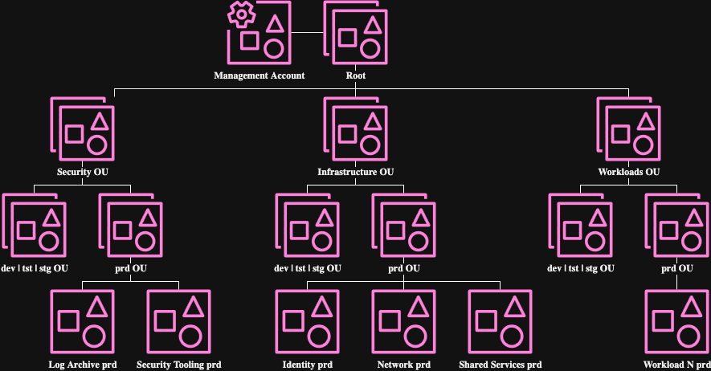
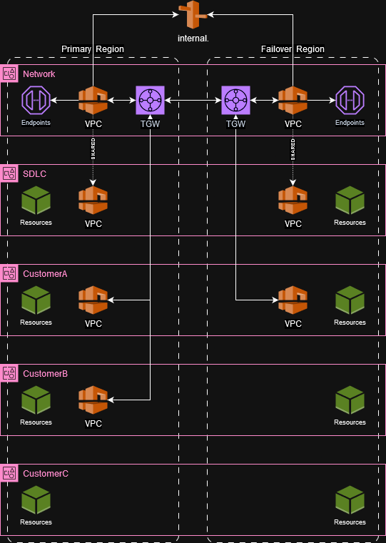
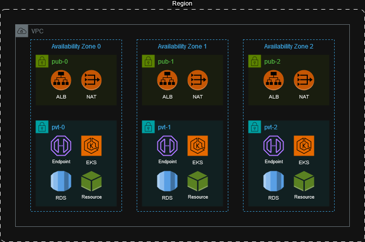
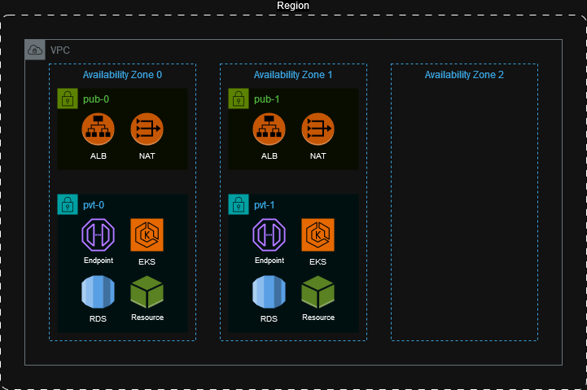

# DevOps

## Project Goals
1. Create my ideal codebase to "lift and shift" a startup or small organization into AWS and EKS
1. Using minimal number tools with high market share utilization (eg terraform, eksctl, helm)
1. Demo with k8s nginx welcome page

### Documentation Reference
- Terraform providers and modules all version locked
- Code written following AWS documentation
  - Well-Architected Framework  https://docs.aws.amazon.com/wellarchitected/latest/security-pillar/welcome.html
  - Prescriptive Guidance Security Reference Architecture https://docs.aws.amazon.com/prescriptive-guidance/latest/security-reference-architecture/org-management.html
  - Best practices for multi-account management https://docs.aws.amazon.com/organizations/latest/userguide/orgs_best-practices.html
  - Building a Scalable and Secure Multi-VPC AWS Network Infrastructure https://docs.aws.amazon.com/whitepapers/latest/building-scalable-secure-multi-vpc-network-infrastructure/welcome.html
  - Latencies between AWS availability zones https://www.flashgrid.io/news/latencies-between-aws-availability-zones-what-are-they-and-how-to-minimize-them

## Architectural Overview

### Org and Accounts
<p align="center"></p>

The organization, organization units, and accounts layout is designed in accordance to the documented best practices for OUs in the [AWS Organizations User Guide](https://docs.aws.amazon.com/organizations/latest/userguide/orgs_manage_ous_best_practices.html). This codebase is can be expanded to accommodate additional OUs such as Sandbox, Suspended, Exceptions, etc.

### VPC Options

#### Failover

| Failover Enabled | Failover Disabled |
| :-: | :-: |
|  | <p align="center"> |

The Virtual Private Cloud and Transit Gateway layout is designed in accordance to the Hub and Spoke model in the [Building a Scalable and Secure Multi-VPC AWS Network Infrastructure Whitepaper](https://docs.aws.amazon.com/whitepapers/latest/building-scalable-secure-multi-vpc-network-infrastructure/transit-gateway.html).

- Service Endpoints are shared to the entire Organization through the Network VPCs and Transit Gateways
- Private R53 zone `internal.` is attatched to the Network VPCs providing standard human-readable DNS for the Endpoints
- SDLC Accounts have Network VPC shared to keep down cost

##### Options

| Variable | Type | Default | Description |
| --- | --- | --- | --- |
| `network_tgw_share_enabled` | boolean | `false` | Network TGW will be shared to this account. |
| `network_vpc_endpoint_services_enabled` | list(string) | `[""]` | Which endpoint services are attached to the Network VPC and shared through the TGW. |
| `network_vpc_share_enabled` | boolean | `false` | Network VPC will be shared to this account. |
| `vpc_enabled` | boolean | `false` | A VPC will be provisioned in the Primary region. |
| `vpc_failover_enabled` | boolean | `false` | A VPC will be provisioned in the Failover region. |

In the Failover Enabled diagram above, the following options are `true`:

| Account | Options |
| --- | --- |
| Network | `network_vpc_endpoint_services_enabled`, `vpc_enabled`, `vpc_failover_enabled` |
| SDLC | `network_vpc_share_enabled` |
| CustomerA | `network_tgw_share_enabled`, `vpc_enabled`, `vpc_failover_enabled` |
| CustomerB | `network_tgw_share_enabled`, `vpc_enabled` |
| CustomerC |  |

In the Failover Disabled diagram above, the following options are `true`:

| Account | Options |
| --- | --- |
| Network | `network_vpc_endpoint_services_enabled`, `vpc_enabled` |
| SDLC | `network_vpc_share_enabled` |
| CustomerA | `network_tgw_share_enabled`, `vpc_enabled` |
| CustomerB | `network_tgw_share_enabled`, `vpc_enabled` |
| CustomerC |  |

#### Subnet HA

| Five Nines | Four Nines |
| :-: | :-: |
|  | <p align="center"> |

Virtual Private Cloud Subnet layout is designed to provide 99.999% ("Five Nines") availability using 3 Subnets across 3 Availability Zones as per the [recommendations and best practices for ECS](https://aws.amazon.com/blogs/containers/amazon-ecs-availability-best-practices/). Although the blog contains best practices for *ECS*, the same logic for providing 99.999% availability applies to EKS, RDS, S3, etc. This codebase also can be configured to provide 99.99% ("Four Nines") availability using 2 Subnets across 2 Availability Zones as a cost savings option by settging `vpc_five9s_enabled = false`.

## Initial Setup

### Prerequisites
- aws-cli/2.17.65
- Terraform v1.9.7
- eksctl version 0.191.0
- kubectl v1.31.1
- helm v3.16.1

### Instructions
1. Create AWS Account to be Organization root
1. Update the terraform/variables.tf with your unique information
   1. org_owner_email_prefix (billg)
   1. org_owner_email_domain_tld (microsoft.com)
   1. company_domain (windows.com)
   1. company_name (microsoft)
   1. company_name_abbr (ms)
   1. team_name (blue)
   1. team_name_abbr (blue)
   1. project_name (windows13)
   1. project_name_abbr (w13)
1. Create IAM User "superadmin"
   1. Attach AdministratorAccess policy
   1. Create an access key to be used in AWS CLI profile named "superadmin"
      ```sh
      aws configure --profile superadmin
      ```
<!-- 1. Deploy terraform/aws/tfstate-backend
   1. Update the terraform/aws/*/backend.tf files
      ```sh
      org root account id   find . -name 'backend.tf' -exec sed -i 's/TFSTATEBACKENDORGACCOUNTID/123456789012/g' {} +
      1. bucket:  find . -name 'backend.tf' -exec sed -i 's/TFSTATEBACKENDS3BUCKETNAME/tfstate-bucket-name/g' {} +
      1. dynamodb table:  find . -name 'backend.tf' -exec sed -i 's/TFSTATEBACKENDDYNAMODBTABLE/dynamodb-tfstate-lock/g' {} +
      ``` -->
1. Deploy terraform/aws/org-ou-account-management to create additional AWS Organization Units and Accounts
   1. Update the terraform/variables.tf account_id map with terraform output
1. Deploy terraform/aws/iam-groups-and-roles
   1. Create AWS CLI profile named "automation" with terraform output
      ```sh
      terraform output -json
      aws configure --profile automation
      ```
1. Deploy terraform/aws/tgw-and-network-vpc
1. Deploy sdlc accounts
   1. Deploy terraform/aws/sdlc-prd
      1. Update eksctl/sdlc-prd-blue.yaml and eksctl/sdlc-prd-failover-blue.yaml with vpc_id and private_subnets for primary and failover from terraform output
      1. Assume automation role in account
         ```sh
         # replace 012345678912 with the account id
         AWS_PROFILE=automation aws sts assume-role \
            --role-arn arn:aws:iam::012345678912:role/automation \
            --role-session-name sdlc-session \
            --duration-seconds 36000
         # replace foo, bar, and helloworld with matching outputs
         export AWS_ACCESS_KEY_ID=foo
         export AWS_SECRET_ACCESS_KEY=bar
         export AWS_SESSION_TOKEN=helloworld
         unset AWS_ACCESS_KEY_ID AWS_SECRET_ACCESS_KEY AWS_SESSION_TOKEN
         ```
      1. Deploy EKS Cluster
         Update the vpc-id and subnet-ids in blue.yml
         ```sh
         eksctl create cluster -f blue.yml &
         eksctl delete cluster --name scc-blue-w12-usw2-blue --region us-west-2 &
         eksctl create nodegroup -f blue.yml &
         eksctl delete nodegroup --cluster scc-blue-w12-usw2-blue --name general --region us-west-2 &
         ```
      1. Deploy cluster-services
         ```sh
         helm upgrade --install cluster-services . --namespace kube-system --force &
         helm uninstall cluster-services --namespace kube-system &
         ```
      1. Deploy nginx welcome page
         ```sh
         helm upgrade --install nginx-welcome bitnami/nginx -f values.yaml --force &
         helm uninstall nginx-welcome &
         ```
         1. Great for troubleshooting deployments
            ```sh
            for i in $(seq 1 30); do helm upgrade --install nginx-welcome$i bitnami/nginx; done &
            for i in $(seq 1 30); do helm uninstall nginx-welcome$i bitnami/nginx; done &
            ```
      1. Test your website
         ```sh
         curl www.yourwebsite.com
         ```
   1. Deploy terraform/aws/sdlc-tst
   1. Deploy terraform/aws/sdlc-stg
   1. Deploy terraform/aws/sdlc-prd
<!-- 1. Deploy terraform/aws/enterprise-ad
   1. This deployment can take up to 2 hours and may fail several times due to AWS throttling, keep running plan and apply until complete
   1. Update the terraform/variables.tf ad_directory_id_connector_network and ad_directory_id_connector_network_failover strings with terraform output
1. Deploy terraform/aws/client-vpn -->
1. Deploy customer accounts
   1. Deploy terraform/aws/workload-customera
   1. Deploy terraform/aws/workload-customerb

## To-Do
- network and sdlc need different deployment options for whether a VPC is created
   - sdlc needs an elegant way to create DNS records to point to VPC endpoints in the shared network VPC
     - even if a VPC isn't created, a route would still need to exist for the account
     - obviously if no VPC is being created then the endpoint wouldn't need ot be created either
   - needs to support multi-regional failover as well
   - WELL LET'S TEST IT!!
      - just start with making R53 entries first, this may be all that is needed
   - bottom line is we have a few different permiations of account layout
      - lowest level config is one shared vpc
      - can then add a tgw
      - can then add vpcs from other accounts
      - all combinations have multi-region support
      - all combination support either 2AZ or five9s 3AZ deployments
- Federated login for devops, operations, and developers
   - https://getstarted.awsworkshop.io/02-dev-fast-follow/02-federated-access-to-aws/02-aws-sso-ad.html
   - https://aws.amazon.com/blogs/architecture/field-notes-integrating-active-directory-federation-service-with-aws-single-sign-on/
   - Also need Windows Admin Server in some account
   - Goal is to have everyone log in to SSO and their priviledges to log in and assume roles will dynamically populate based on their groups in AD
   - might need to make a separate DOMAIN.TLD for services like clientVPN and enterprise AD domains if any
- Triggering a DR event
   - ACL allows no traffic in one subnet
- Implement backend tfstate lock with dynamodb
   - need bucket, table, and access set up uniquely for superadmin and automation users
- Complete sdlc dev, tst, and stg
- Need scalable solution to deploy security settings such as aws_ebs_snapshot_block_public_access, block public s3 access, default ebs encryption, etc
   - probably need a step after account creation before iam to deploy org-security-settings
- Opt out of all AI policy https://docs.aws.amazon.com/organizations/latest/userguide/orgs_manage_policies_ai-opt-out.html
- Implement Rust server
- Implement the Well-Architected Tool https://docs.aws.amazon.com/whitepapers/latest/organizing-your-aws-environment/organizing-your-aws-environment.html
- Complete some kind of automation to convert drawings into png for this documentation
- Base docker images for all distros
   - initially just docker images which run apt-get upgrade or yum upgrade to get patches
- Packer and ansible example for building base AMIs
- Centralized logging with compression and glacier archive
   - DNS logs sent to CloudWatch Log Group and S3 (with cross-regional replication and glacier)
   - ALB logs send to CloudWatch Log Group and S3 (with cross-regional replication and glacier)
- EKS autoscaling examples
   - CPU
   - Sessions
- SCP enforcing features
   - EBS volume encryption
   - S3 buckets never public
   - Disable unlimited burstable instance credits
   - delete all default VPCs in all regions of every account
- AWS Backup with Multi-AZ and glacier
- MFA enforced organization-wide
- AD
   - Update directory AD and client VPN so groups in AD manage network access to AWS environments
   - Add Windows Server 2019 cheap instance to Directory for AD administration
- move desired R53 healthcheck source locations to a var and local design
- ALB sec group with cool way of allowing ingress (nonprod through private CVPN, prod through public)
- Mozilla Secrets OPerationS (SOPS) protects secrets in code using Key Management System (KMS) Customer Managed Key (CMK)
- break glass entry for accounts https://docs.aws.amazon.com/whitepapers/latest/organizing-your-aws-environment/break-glass-access.html

## Known Issues
- terraform/aws/org-ou-account-management/main.tf
  resource "aws_servicequotas_service_quota" "ACCOUNT_NUMBER_LIMIT_EXCEEDED"
  https://github.com/hashicorp/terraform-provider-aws/issues/32638
  In the meantime request quota increases manually
