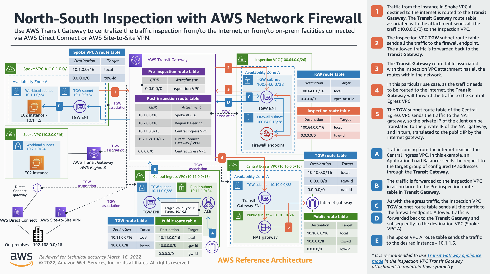

[Return Home](../README.md#documentation)

# Architectural Overview

## Org and Accounts

The organization, organization units, and accounts layout is designed in accordance to the documented [Best practices for a multi-account environment](https://docs.aws.amazon.com/organizations/latest/userguide/orgs_best-practices.html) and [Best practices for managing organizational units (OUs) with AWS Organizations](https://docs.aws.amazon.com/organizations/latest/userguide/orgs_manage_ous_best_practices.html). This codebase is can be expanded to accommodate additional OUs such as Sandbox, Suspended, Exceptions, etc.

## VPC Inspection Model

This repo follows the documented guide for North-South Inspection with AWS Network Firewall as [documented by AWS](https://d1.awsstatic.com/architecture-diagrams/ArchitectureDiagrams/inspection-deployment-models-with-AWS-network-firewall-ra.pdf).