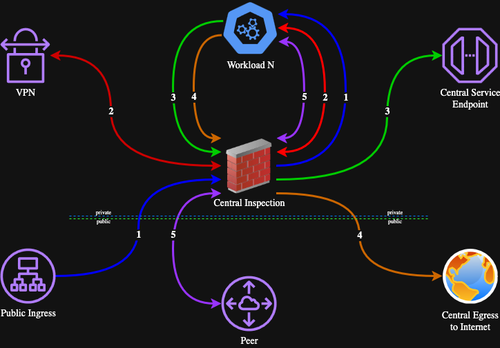

[Return Home](../README.md#documentation)

# Architectural Overview

## Org and Accounts
The organization, organization units, and accounts layout is designed in accordance to the documented [Best practices for a multi-account environment](https://docs.aws.amazon.com/organizations/latest/userguide/orgs_best-practices.html) and [Best practices for managing organizational units (OUs) with AWS Organizations](https://docs.aws.amazon.com/organizations/latest/userguide/orgs_manage_ous_best_practices.html). Specifically, the [Separating business units with significantly different policies](https://docs.aws.amazon.com/whitepapers/latest/organizing-your-aws-environment/advanced-ous.html#extended-workload-oriented-ou-structure) is utilized for maximum security granularity and scaleability.

This codebase is can be expanded to accommodate additional OUs such as Sandbox, Suspended, Exceptions, etc.

## VPC Central Inspection Model
This repo follows the documented guide for North-South Inspection with AWS Network Firewall as [documented by AWS](https://d1.awsstatic.com/architecture-diagrams/ArchitectureDiagrams/inspection-deployment-models-with-AWS-network-firewall-ra.pdf). Behold, the Central Inspection Cephalopod (resemblence unintended):

1. Public Ingress to Inspection to Workload
1. Client VPN / Direct Connect / Site-to-Site VPN to Inspection to Workload (bi-directional)
1. Workload to Inspection to Service Endpoint
1. Workload to Inspection to Internet
1. Workload to Inspection to VPC Peer / NAT / VPN (bi-directional)

Because everything deployed is a "workload", including even the Shared Services and SDLC accounts, this setup enables maximum scalability and cost savings. Each additional account benefits from the same Central Inspection model, Logging, Central Service Endpoints, and Central Egress to Internet, without any additional configuration requirements.

## Delegated DNS
To align with best practices for DNS and service isolation DNS delegation is featured. The table below represents an example featuring GitHub being hosted in the shared services account.

|   | type | account | direct |
| ---: | :--- | :--- | :--- |
| domain.tld | zone | network | |
| github.domain.tld | CNAME | network | github.svc.aws.domain.tld |
| aws.domain.tld | zone | network | |
| svc.aws.domain.tld | zone | shared-services | |
| github.svc.aws.domain.tld | CNAME | shared-services | github-blue.svc.aws.domain.tld |
| github-blue.svc.aws.domain.tld | A Latency | shared-services | load balancer use1, load balancer usw2 |

Visiting github.domain.tld will:
1. Direct to github.svc.aws.domain.tld
1. Directs again to github-blue.svc.aws.domain.tld
1. Direct via A Latency record to fastest-responding load balancer

The domain.tld zone and records directing traffic to svc.aws.domain.tld are contained in the network account, their records are not likely to change, and service control policies protect anyone but superadmin from changing them. This provides complete blast radius isolation for the service to the owners, because a deployment only needs to change the records in the delegated account.

All services which can be designed this way should be.

For services deployed in the multi-tenant sdlc accounts, or isolated accounts, the concept is the same. Just replace github with the service name and the svc with the sdlc or the workload's r53 identifier.

When changes to subdomain configuration need to be tested they can be done on `dev`, `tst`, and `stg` environments respective to that subdomain. For example to roll out changes on shared services, the addresses would be `application.svcdev.aws.domain.tld`, where as changes on the network itself would be rolled out to `application.svc.devaws.domain.tld`. The production environment does not and should not include any indication of its specific environment; eg production does not contain `prod` or `prd` anywhere in the DNS.